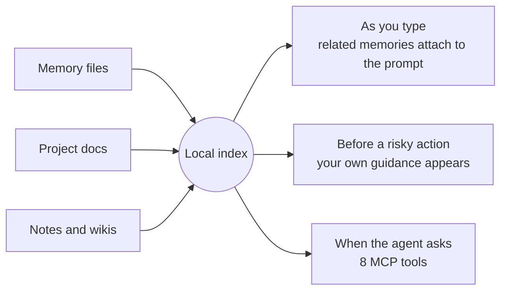

<div align="center">

# local-brain

### What does the AI era need? A brain.

[](https://github.com/honeyground-org/local-brain/actions/workflows/ci.yml)

An open-source memory system for coding agents that lives on your machine.<br>
The right knowledge at the right moment, so work gets more efficient and your agent performs at its best.

[](LICENSE)


</div>

```bash
git clone https://github.com/honeyground-org/local-brain ~/tools/local-brain
cd ~/tools/local-brain && ./install.sh --with-hook --with-guard
```

---

## Why the AI era needs a brain

Models keep getting faster. What they cannot bring by themselves is **your context**: your decisions,
your lessons, your project. Without it, every session starts from zero. A brain system carries it into
every session.

| | |
|---|---|
| **Efficiency** | Stop re-explaining. Decisions, lessons and context come back on their own. |
| **Performance boost** | Better context, better output. The agent sees what you already learned before it acts. |
| **Compounding know-how** | Every session adds to it. What you learn grows instead of evaporating. |

## How it works: one local index, three moments



- **As you type.** A host hook reads each prompt and attaches only the memories that clear your
  calibrated threshold, and stays quiet otherwise. There is no command to remember.
- **Trigger phrases.** Declare a phrase in a memory's front matter (`triggers: ["payments refactor, continue"]`).
  Typing it brings that exact thread back, with no score involved. `brain triggers` checks every declaration.
- **Before a risky action.** The behaviour layer puts the guidance you once wrote in front of the agent
  right before a push, a rebase or a migration. The rule matches the tool call; the *wording* lives in
  your memory file, so editing the memory changes what is said. No rules ship with brain: they are
  learned from your own tool history (`brain rules --discover`).
- **When the agent asks.** Eight MCP tools: `recall` · `remember` · `neighbors` · `brain_status` ·
  `brain_suggest` · `brain_feedback` · `reindex` · `timeline`.

## Adaptable by design

The core stays the same. Everything around it plugs in as an adapter, so you can swap any of them
without touching your memories.

| Slot | Plugs in today |
|---|---|
| **Agent host** | Claude Code · Codex · any MCP client |
| **AI engine** (optional) | Gemini · OpenAI · Anthropic · any OpenAI-compatible server, such as a local Ollama · none |
| **Data sources** | memory files · project docs · Obsidian and wikis · any folder (`brain add <path>`) |
| **Vector database** | the local SQLite copy · Qdrant |
| **Graph database** | the local SQLite copy · Neo4j |
| **Scheduler** | launchd · cron |

**Swap the databases, keep your data.** Similarity search and graph traversal can each be served by a
database built for that job. Your memories stay plain Markdown files and the local SQLite copy stays
canonical, so switching is a sync, not a re-embed, and `brain stores --check` asks both the same questions
to prove they agree (see [Storage backends](#storage-backends)). `brain export` / `brain import` carry what
you earned to another machine.

## Built to be trusted

- **Calibrates to you.** Thresholds are measured against your own corpus, not hardcoded, and the margin
  above the noise floor is learned from your own sample by a Kalman filter. A score that means
  "confident" on 900 documents means nothing on 40.
- **Measured, not assumed.** `brain score --compare` puts it side by side with the alternatives you
  actually had: a flat index file plus `grep`, and the coding agent working alone. Accuracy, recall,
  how much text had to be read, and speed. Every check in `tests/` runs a **control group first**, so a
  green result is evidence, not luck.
- **Private by default.** Word search never opens a socket. AI engines are opt-in, and secret-shaped
  values are masked before anything leaves (see [Privacy](#privacy)).
- **Always current.** The MCP server picks up new code on disk by itself, so an update needs no restart.
- **Zero third-party dependencies.** Standard library only, on the system `python3` (3.8+). No pip
  install, no build step.

---

## Commands

All commands work from any directory once installed (`brain <command>`).
`brain help` prints this same grouping with live paths.

### Everyday

| Command | What it does |
|---|---|
| `brain status` | Health check — what to fix, separated from what to merely watch |
| `brain dashboard` | Status + performance comparison as a local HTML page, opened in your browser |
| `brain recall <text> -t <synonyms>` | Recall, right in the terminal (pass synonyms with `-t`, see below) |
| `brain recent` | Chronological view — the answer to "what was I doing?", which has no keyword |
| `brain neighbors <name>` | Graph neighbours — widen from a hit to its related context |
| `brain why <file>` | Why is this file the way it is — purpose, principles, and what changed |

### Measuring and comparing

| Command | What it does |
|---|---|
| `brain score` | Raw comparison table + the 7-axis score |
| `brain score --compare` | brain ↔ grep ↔ agent-alone: accuracy, recall, text read, speed |
| `brain score --axes` | The 7 axes only. The composite compares *your own* points in time |
| `brain score --full` | Measures the accuracy axis for real — calls the judge model, spends budget |
| `brain score --history` | Compare points in time: what moved after you changed something |
| `brain budget` | Judge-model daily budget, and the three thresholds the tool sets for itself |

### Feeding and fixing memory

| Command | What it does |
|---|---|
| `brain index` | Incremental index. `--full` rebuilds everything |
| `brain detect` | Find what is worth remembering, with evidence. `--add` registers it |
| `brain suggest` | Self-improvement suggestions — stale, orphaned, duplicated memories |
| `brain triggers` | Every declared trigger phrase, plus checks (uniqueness, resolution, shadowing) |
| `brain index-audit` | Is each line of your index file still reachable if you delete it? |
| `brain feedback <name> useful\|wrong\|stale` | Rate a recall — it changes future ranking |

### Corpus (what is in scope)

| Command | What it does |
|---|---|
| `brain sources` | Registered corpora + measured reality (file count, indexed documents) |
| `brain add <path>` | Add a corpus — `--name --prior --include --exclude --depth --no-embed` |
| `brain remove <name>` | Remove a corpus by name or path |

### Semantic search and calibration

| Command | What it does |
|---|---|
| `brain engines` | Which AI engine fills each role (embed · judge), what it is sent, how to change it |
| `brain stores` | Which database serves vector search and the graph (the local copy · any backend in `brain/backends/`); `--sync` · `--check` |
| `brain vec status\|build\|calibrate\|search` | Meaning-based search via remote embeddings; `calibrate` also re-measures the judge |
| `brain calibrate` | Re-measure the lexical threshold against this corpus |
| `brain eval-init` | Draft an evaluation set from *your* history (someone else's gold is theirs) |

### Behaviour layer

| Command | What it does |
|---|---|
| `brain rules` | Active rules — learned from your use, or written by you in `rules.json` (none ship) |
| `brain rules --discover` | Ask the judge model for new rule candidates (incremental, cached) |
| `brain rules --stale` | Rules whose actions nobody has performed in the period |
| `brain rules --approve <signal>` / `--disable <id>` | Turn one on / off. Disabled stays disabled |
| `brain rules --auto` | Promote candidates over the threshold without a human |

### Moving between machines

| Command | What it does |
|---|---|
| `brain export` | What you *earned* in one file — calibration is deliberately excluded |
| `brain import <bundle>` | Merge another machine's bundle. Dry-run by default; `--apply` to commit |

### Safety and upkeep

| Command | What it does |
|---|---|
| `brain privacy` | Audit the outbound door — which memories hold secret-shaped values (values never shown) |
| `brain i18n --check` | Translation catalogs — missing keys, unused keys, placeholder mismatches |

**Tip: pass synonyms to `recall` with `-t`.** Memories are often written in different words than your
question; on the author's own notes, synonyms lifted hits from 2 of 9 questions to 8 of 9.

---

## Languages

### Interface (dashboard, CLI status output)

Six languages ship as JSON catalogs in `brain/locales/`:

| | English | German | Spanish | French | Japanese | Korean |
|---|---|---|---|---|---|---|
| Dashboard | ✅ | ✅ | ✅ | ✅ | ✅ | ✅ |

English is the source of truth; a missing key falls back to English rather than breaking the screen.
The language is chosen by, in order: `"language"` in `config.json` → `BRAIN_LANG` → English. Another
language is something you choose (`./install.sh --lang ko`), never something inferred from your OS.
`brain i18n --check` counts missing keys and placeholder mismatches, so translations stay in step with the code.

### Search (tokenizer)

| Language | How it is indexed | Evaluated by |
|---|---|---|
| English | words | a labelled question set |
| Korean | 2- and 3-grams, plus a Korean ↔ English loanword bridge | a labelled question set |
| German · Spanish · French | words, accents kept | tokenizer checks |
| Japanese | split by script (kanji · hiragana · katakana), then 2- and 3-grams | tokenizer checks |

Every language reaches the index (`tests/verify_tokenizer_langs.py`). English and Korean also have
labelled evaluation sets behind their quality numbers; `brain eval-init` drafts one from your own history
for any language.

---

## What runs automatically

- **Recall hook** — on every prompt; adds memories only when the score clears the
  calibrated threshold.
- **Index refresh** — at session start, and again just before recall if a new
  memory appeared. Write a memory file by hand and the next recall finds it.
- **Scheduled jobs** — semantic indexing and rule discovery, once a day.
  `brain status` reads their logs to show the last run. On macOS the installer uses `launchd`
  (`install/launchd.sh`), which also catches up on runs that were due while the machine slept.

---

## MCP

```bash
claude mcp add brain --scope user -- "$(pwd)/bin/brain-mcp"
```

Tools: `recall` · `remember` · `neighbors` · `brain_status` · `brain_suggest` ·
`brain_feedback` · `reindex` · `timeline`

The MCP server and the CLI call the **same core functions**, so a fix lands in both at once.
The server also picks up new code on disk by itself: after an update there is nothing to restart.

---

## Install

```bash
./install.sh                            # detect → config → index → register MCP → verify
./install.sh --with-hook --with-guard   # fully local: no AI engine, nothing leaves the machine
./install.sh --all --embed gemini --judge gemini        # + meaning-based search (GEMINI_API_KEY)
./install.sh --all --embed openai --judge anthropic     # mix providers (OPENAI_API_KEY, ANTHROPIC_API_KEY)
./install.sh --all --stores docker      # + vector search on Qdrant and the graph on Neo4j, both in Docker
./install.sh --all --graph-store neo4j  # + only the graph, in Docker — each role is chosen on its own
./install.sh --help                     # choose what to enable
```

A key in your environment turns nothing on by itself — an engine is used only
when you name it (see *AI engines and their roles* below).

## AI engines and their roles

Word search, the hook, the behaviour layer and every self-measurement run
locally. An outside AI model is used for exactly **two jobs**, and you choose
which model fills each one — or none:

| Role | What it does | What it is sent | Used by | Engines |
|---|---|---|---|---|
| `embed` | turns notes and questions into vectors, so a question finds a note written in other words | note chunks (≤1200 chars) and each searched question | meaning-based search | `gemini` · `openai` (or any OpenAI-compatible server) · `none` |
| `judge` | reads a question and up to 20 candidate notes and scores 0–10 whether each one answers it | the question and candidate excerpts (≤420 chars each) | two-stage recall when word search is silent · `brain score --full` · behaviour-rule discovery | `gemini` · `openai` (or any OpenAI-compatible server) · `anthropic` · `none` |

Secret-looking values are masked before anything is sent (`brain privacy`).

```bash
brain engines                                     # which engine fills each role, where that choice came from, what it sends
brain engines --set judge=anthropic               # Claude as the judge (ANTHROPIC_API_KEY)
brain engines --set embed=openai --base-url http://localhost:11434/v1 --model nomic-embed-text
                                                  # a local Ollama — nothing leaves the machine, no key
brain engines --set embed=none judge=none         # turn both off
```

- **Nothing is chosen for you.** A key that happens to be set (`GEMINI_API_KEY`,
  `OPENAI_API_KEY`, `ANTHROPIC_API_KEY` — often another tool's) is listed as
  *found, not used* until you choose that engine.
- **A judge's threshold belongs to that judge.** Scores from different models
  (or the same model asked a different question) sit on different scales, so the
  threshold is stamped with the judge it was measured on. After switching, the
  judge adds nothing until `brain vec calibrate` measures it again.
- **A different embedder is a different vector space** — after switching, run
  `brain vec build`.
- Default models are conveniences, not recommendations: `gemini-embedding-2` /
  `gemini-flash-lite-latest`, `text-embedding-3-small` / `gpt-4.1-mini`,
  `claude-opus-5-5` (as a judge, at low effort). Override with `--model`.

Idempotent — safe to run repeatedly; it merges into your existing settings rather
than overwriting them. If your machine is laid out unusually, paste
`SETUP-PROMPT.md` into your coding agent instead and let it install by looking around.

Data lives in `~/.brain/` (or under your host's home — `brain help` prints the one in use). The SQLite
index is a derivative — delete it and `brain index --full` rebuilds it.

---

## Storage backends

Two kinds of question have databases built for them, and brain lets each one be answered there:

| Role | What it answers | Backends | What is sent |
|---|---|---|---|
| `vector` | similarity search over note embeddings | `sqlite` (default) · `qdrant` · `chroma` · `pgvector` · `milvus` | the vectors and `{doc_id, chunk_no}`, never text |
| `graph` | the links between notes: neighbours, incoming links, link targets | `sqlite` (default) · `neo4j` · `memgraph` | document ids and links; names only with `--names` |

What is sent is decided by the role, not by the backend: a backend is handed only that, so it cannot send
more. Each backend is one file in `brain/backends/` — see [Adding a storage backend](docs/STORAGE.md).

```bash
brain stores                                                   # which database answers each role, and whether it is in sync
brain stores --set vector=qdrant --url http://localhost:6333   # choose, then sync the local copy across
brain stores --set graph=neo4j --url http://localhost:7474     # password from NEO4J_PASSWORD or secrets.json
brain stores --help                                            # every backend's options, one flag each
brain stores --check                                           # the same questions to both, compared
brain stores --set vector=sqlite                               # back to the local copy
```

How it stays trustworthy:

- **The local copy stays canonical.** Embeddings are earned and the graph is derived from your files, so
  both always live in the local SQLite file too. A dedicated database is a serving index: switching to it
  is a sync, never a re-embed.
- **Only the difference travels.** A ledger records what each target already holds; indexing and
  embedding push only what changed, and a sync with nothing new sends nothing.
- **It answers only when it is in sync.** Until the first sync completes, or whenever the database does
  not answer, the local copy answers instead. The failure is recorded for `brain stores`, and the
  database is not asked again for a minute.
- **Agreement is measured, not assumed.** `brain stores --check` replays cached questions against both
  and compares top results, scores, neighbours, edges and link targets.

Measured on the author's notes (1,909 documents, 9,590 chunks, 3,376 links; 2026-10-07, both databases
on the same machine): identical answers on every question compared, similarity search **188 ms → 12 ms**
with Qdrant, and one-hop neighbours for every document **3.4 s → 0.48 s** with Neo4j.

### Run them in Docker

```bash
./install.sh --stores docker               # at install time: every role's default (Qdrant, Neo4j)
./install.sh --graph-store neo4j           # or one role on its own; NAME=URL for a server that already runs
brain stores --docker                      # any time later: both defaults
brain stores --docker graph=memgraph       # or one role, with the backend you name; the other keeps running
brain stores --docker-stop                 # stop them; the data stays, and the local copy answers meanwhile
```

- What to run comes from each backend's own declaration: a pinned image (`qdrant/qdrant:v1.19.2`,
  `neo4j:5.26.31-community`, `memgraph/memgraph:3.13.2`, `chromadb/chroma:1.5.9`,
  `pgvector/pgvector:0.8.7-pg17`, `milvusdb/milvus:v2.6.25`), ports bound to 127.0.0.1 only,
  `restart: unless-stopped`. One service per
  role: starting one leaves the other running; replacing a role's backend removes the old container and
  keeps its data folder.
- **The data lives in plain folders under the brain's home** (`<home>/stores/<backend>/`),
  not in Docker volumes, so removing the containers, the images or Docker itself leaves it in place.
  Measured: with the containers removed and created again, nothing had to be sent again and every answer
  matched.
- **If a database ever comes back empty, it refills itself.** Each sync compares what the database holds
  with what it was sent; when they differ, the next sync rebuilds it from the local copy.
- A password a backend needs (Neo4j's) is generated into `secrets.json` (0600) and handed to Docker by
  name, never on a command line.
- **The databases' own usage reporting is turned off.** Qdrant, Neo4j and Memgraph all report home by default
  (measured 2026-10-10: Qdrant logs *Telemetry reporting enabled*, Neo4j answers
  `dbms.usage_report.enabled = true`); brain starts them with it off, and a backend cannot be added
  without saying how its image's reporting is turned off. Containers started before this change keep
  reporting until `brain stores --docker` recreates them (the data stays).
  **Measured, not declared:** the Docker check watches every container from inside its network
  namespace for at least 90 seconds and fails on any connection off the machine — with a control that
  connects out and must be seen. With reporting on, Qdrant and Memgraph were caught connecting to their
  telemetry servers within a minute; with brain's settings, nothing.
- After a reboot the containers come back as soon as Docker starts. On macOS and Windows, turn on
  *Start Docker Desktop when you sign in*; until Docker is up, the local copy answers.

Adding another database is one file in `brain/backends/` and nothing else: its choice, its option flags,
its Docker container, the installer's `--vector-store` / `--graph-store` and the status screen all come
from that file, and `tests/verify_store_adapters.py` proves it by dropping two new backends into a copy
of brain and running the whole contract against them. How to write one: [docs/STORAGE.md](docs/STORAGE.md).

## Who sets which number

Nothing here is one person's setting. Every number comes from one of four places, in this order:

| Owner | Examples | Where you change it |
|---|---|---|
| **You** | which kinds the graph colours · how fast each kind goes stale · which sections of your index are standing rules · which kinds count as rules | `config.json`: `graph_kinds` · `stale_days` · `index_sections` · `directive_kinds` (or `<!-- brain: … -->` after a heading) |
| **Your data** | the hook threshold (noise floor of *your* corpus × a margin **learned from your sample**) · which filename prefixes are kinds · what "short" means (your shortest 30% of prompts) · the corpus's languages | measured — `brain calibrate`, `brain status` |
| **Your host / engine** | which index the host loads by itself and its measured read limit · its memory folders, rule files and command prefixes · a provider's rate limits (only Gemini's are known; any other provider is unpaced until it refuses, and the refusal teaches the real limit) | the host adapter (`brain/hosts.py`) and `brain engines` |
| **The method** | the expected hook firing band (15–75 %) · the regression guard (1.5 hits) · the identity bonus · lexicon and proxy settings · the margin's *starting point* (1.35) | environment variables — `BRAIN_CALIB_MARGIN` (fixes the margin), `BRAIN_FIRE_RATE_OK="15,75"`, `BRAIN_ID_BOOST`, `BRAIN_LEXICON_*`, `BRAIN_PROXY_*`, `BRAIN_RULE_*` |

**The margin learns.** It starts at 1.35 with a wide uncertainty and, every calibration, measures which
margin your own sample likes best — resampled 200 times, so a best value that jumps around counts as a weak
observation. A one-dimensional Kalman filter weighs each observation by how much it can be trusted: until it
has three observations' worth of new evidence it only measures, then it uses its estimate, and a small or
flat sample barely moves it. Each
observation counts for what it adds (the share of questions that answered differently from the last one
used), a label-free proxy sample may only push it up, and the regression
guard still refuses any threshold that does worse than the one in place. `brain calibrate` shows the
estimate, its uncertainty and whether it is still measuring. When there is no ruler at all (a corpus too
small to measure), the hook stays silent rather than guess.

---

## Tests

Each of these states its own pass criteria in the file, and runs a control group
before trusting its result.

Two kinds live side by side. Most run anywhere on fixtures (`verify_host_neutral`, `verify_user_values`,
`verify_corpus_kinds`, `verify_index_roles`, `verify_first_day`, `verify_engines`…). Others measure
**your own** notes, labelled questions or session history — on a machine without them they stop with
**exit code 77 (skipped)** and say what is missing, rather than pass on nothing or fail for no reason.
`python3 tests/clean_room.py` runs every check the way CI does — the tracked files copied into an
empty folder, a fresh empty home for each check. Measured 2026-10-10 on macOS: 45 green, 13 skipped,
0 red (with a local Qdrant running; without one, the live store check is one more skip). CI runs it on
Linux, macOS and Windows with Python 3.8 – 3.13, and supplies Qdrant, Neo4j and Docker so nothing that
matters is skipped there.

```bash
python3 tests/clean_room.py             # every check below, in a clean room
python3 tests/verify_recall.py          # recall quality regression
python3 tests/verify_reachability.py    # "still reachable after removal from the index?"
python3 tests/verify_vs_grep.py         # ★does it beat grep★ — reads less, hits more
python3 tests/verify_related.py         # the graph must not steal the answer's slot
python3 tests/verify_vectors.py         # semantic search: 3 harm checks + 1 usefulness
python3 tests/verify_guard.py           # every behaviour rule actually fires
python3 tests/verify_engines.py         # each AI engine adapter, and that a stray key chooses nothing
python3 tests/verify_ruledisc.py        # does discovery re-find the hand-written rules?
python3 tests/verify_privacy.py         # intercepts HTTP and inspects the real request body
python3 tests/verify_i18n.py            # translations do not rot silently
python3 tests/verify_english_only.py    # no Korean left in any shipping file
python3 tests/verify_first_day.py       # someone else's first day: install, index, every screen renders
python3 tests/verify_measure_isolation.py  # a measurement never changes the index under anyone else
python3 tests/verify_server_refresh.py  # a long-running MCP server answers with the code on disk
python3 tests/verify_stores.py          # vector and graph databases are replaceable: sync, diff, fallback
python3 tests/verify_stores_live.py     # Qdrant and Neo4j, live: the same answers as the local copy
python3 tests/verify_docker_stores.py   # Docker: data survives restarts and removed containers, refills itself
python3 tests/verify_pr_report.py       # the pull-request rules, the review gate and CODEOWNERS can each fail
```

---

## Layout

| File | Role |
|---|---|
| `brain/textindex.py` | Tokenization — Korean 2/3-grams + ASCII words. **Why not FTS5** is documented here |
| `brain/store.py` | SQLite schema, incremental indexing, migrations, evidence-date extraction |
| `brain/search.py` | IDF-weighted recall + one-hop graph bridge |
| `brain/health.py` | Distortion diagnostics (orphans, broken links, stale evidence, duplicates) |
| `brain/privacy.py` | The outbound door — masks **values** before embedding/judging; key names survive |
| `brain/guard.py` | Behaviour layer — surfaces the guidance attached to an action |
| `brain/ruledisc.py` | Discovers behaviour rules from use: transcripts × memories → judge |
| `brain/hosts.py` | Host adapters — Claude Code, Codex, generic |
| `brain/i18n.py` | Message catalogs, English-first |
| `brain/stores.py` | Storage backends — which database serves each role, the sync ledger, the fallback |
| `brain/vecstore.py` | Vector stores — the local scan and Qdrant |
| `brain/graphstore.py` | Graph stores — the local link table and Neo4j |
| `brain/dockerstores.py` | Qdrant and Neo4j in Docker, with the data in folders of your own |
| `brain/server.py` | MCP over stdio (JSON-RPC, no SDK); refreshes itself when the code on disk changes |
| `brain/cli.py` | Terminal entry point — same core as the server |
| `config.json` | Single source of truth for what gets indexed. A new corpus is one entry |

## Privacy

Nothing leaves your machine unless you choose an AI engine (`brain engines`) or a database on another
host (`brain stores`; a database sent vectors or ids, never text). When you choose an engine,
everything on the way out passes through `brain/privacy.py`, which masks
credential-shaped **values** while keeping key names searchable. Per-source
(`--no-embed`) and per-document (`embed: false`) opt-outs exist for anything that
should never be sent at all. `brain privacy` audits what is still exposed —
and never prints the values themselves.

### What a key turns on

Word search is **always local** — it never needs a key and never opens a socket.
Two things can leave, and only through an engine you chose (`brain engines`):

| | |
|---|---|
| turns it on | choosing an engine — `--embed` / `--judge` at install, or `brain engines --set`. Its key comes from the provider's variable or `secrets.json` (0600) |
| what then goes out | **embed**: chunks of **every source, by default** — your personal memory included (`embed: true` is the default and no corpus is special-cased). **judge**: the question and short excerpts of up to 20 candidate notes |
| what does **not** go out | anything a source or a document marked `embed: false`; and everything, always, while no engine is chosen. A local OpenAI-compatible server (`--base-url http://localhost…`) keeps both on the machine |
| who sends it | `brain vec build` and the daily `brain-vec-daily` job (embed); recall when word search is silent, `brain score --full` and the daily `brain-rules-daily` job (judge) |

**A key that is merely present is never used.** `GEMINI_API_KEY`,
`OPENAI_API_KEY` and especially `ANTHROPIC_API_KEY` are often another tool's —
your coding agent's own, say. Choosing an engine because its key happened to be
set would be the one path where content leaves a machine whose owner never
decided it should, so brain lists such keys as *found, not used*.
(The scheduled jobs are narrower still: they do not inherit your shell, so they
only see a key written into `secrets.json`.)

Turning a corpus off is one field — and `brain privacy` prints the result, so you
never have to trust this paragraph:

```bash
brain add ~/work/secret-docs --no-embed    # or "embed": false in config.json
brain privacy                              # → blocked per source: [...]
```

Once an embedder is chosen, the default is "everything may be embedded", so meaning-based search
covers all of your notes; opt out per source or per document as shown above. Until one is chosen,
`brain engines` and the installer say plainly that it is off and how to turn it on.

## Contributing

local-brain is built in the open, and every change goes through the same path:

```
proposal issue ──► pull request ──► automatic checks ──► PR report ──► reviewers ──► merge queue ──► main
 (behaviour       (template:         (clean room on       (impact,       (code owners;   (re-checked on
  changes)         purpose, effect,    3 OSes, live DBs,    what is         high impact:    the latest main,
                   extensibility,      Docker, release      missing,        2 incl. a       squash merge)
                   risks, checks)      gates, PR rules)     reviewer        maintainer)
                                                            summary)
```

- **[CONTRIBUTING.md](CONTRIBUTING.md)** — set up, the rules every change follows, how to write the pull
  request, what each automatic check does and how to fix it.
- **[GOVERNANCE.md](GOVERNANCE.md)** — maintainers and area owners (and how to add one), how impact
  decides the review, what an important change has to show before it merges, and when and how an admin
  may bypass review.
- **[SECURITY.md](SECURITY.md)** — report security problems privately.
- **[docs/ROADMAP.md](docs/ROADMAP.md)** — where the project is going and the principles behind it.

## License

Apache License 2.0 — the full text is in [LICENSE](LICENSE). Use it, change it, ship it
inside something commercial; keep the notice and say where it came from.
